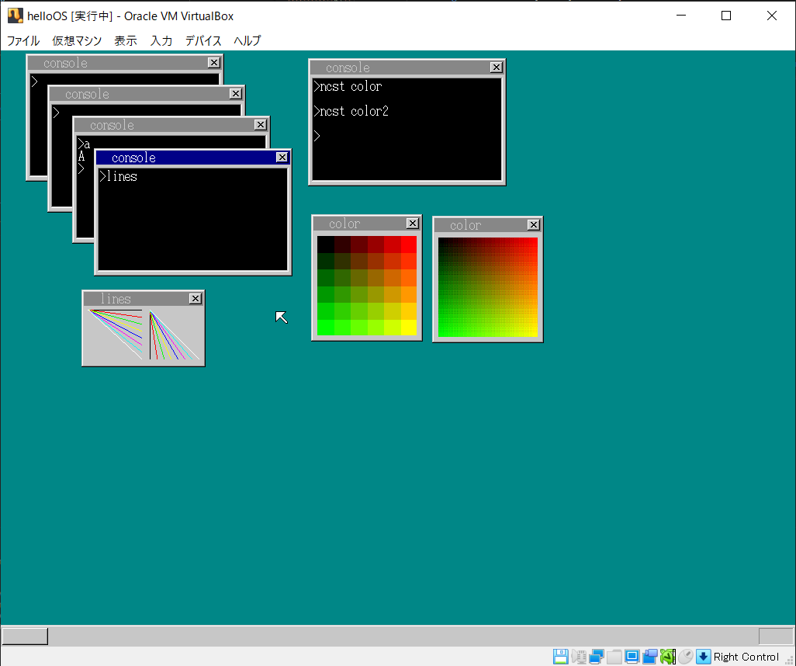

# 30日OS

23日目



## 1日目

- フロッピーなんてないんだけど...
  - VirtualBoxでつくるqiita
  - <https://qiita.com/nao18/items/e1b9b77f154e4d5239e5>

## 2日目

- Makefileどう書き換えればいいんだ...
  - <http://tsurugidake.hatenablog.jp/entry/2017/08/15/202414>

## 3日目

- (AT)BIOS
  - INT(0x13) <http://oswiki.osask.jp/?%28AT%29BIOS>
- <https://qiita.com/pollenjp/items/8fcb9573cdf2dc6e2668>
- コンパイルのためにmformatなるものでなんか変えるらしい
  - `apt install mtools`
- <https://github.com/chikoyoshi/30days_OS>
- haribote.hrb の作成
  - bootpack.o が _GLOBAL_OFFSET_TABLE_ というシンボルを参照してしまう。
  - -> PIC のためのシンボルとのことだが、今回は不要なので CFLAGS に -fno-pic を追加して回避した。
  - <https://github.com/harrybotter30/haribote/blob/master/doc/harib00i.md>

## 4日目

とくにつまるところ無し

## 5日目

- またなんか持ってきやがったな！！！！！
  - Font探すのが面倒だったから[keita/30daysOS](https://github.com/keita99/30dayOS/blob/master/day_05/harib02e/hankaku.txt)さんからいただいてきた
  - 変換はこっちの方のコードを参考にさせていただいた
- `sprintf`が`#include<stdio.h>`じゃできないぞ～～～
  - 直接ライブラリを指定してみる？`@Makefile`
  - `/lib/x86_64-linux-gnu/libc.so.6`
  - `/usr/include/stdio.h`
  - うまくいかねぇ...
  - `stdio.h`の中見てみたけどexternで実質なにもないじゃん
  - <http://www.rcc.ritsumei.ac.jp/2017/1217_8241/>
  - あきらめてみんながやっているように`sprintf`を作っていただいたものをコピペ...
- nasmfunc.asmを書き換えて関数を増やした．

## 6日目

- 分割コンパイル
  - 結構なやんだ
  - gccのオプションとかまとめた
  - オブジェクトファイルとソースコードがっとまとめちゃってるけど
- 割り込み処理がいかなくて悩んでいた
  - `io_sti()`の宣言を`bootpack.h`に書きそびれていた
  - `init_pic()`を`int.c`で`init_pid()`とタイポしていた
- なんか重大なエラーが発生する
  - 
  - `nasmfunc.asm`の`io_in32:`が間違っていたので書き換え
  - `dsctbl.c`の中のアドレスを定数宣言した値にすべて書き換えたらうまく動いた！

## 7日目

- a なんかキーボードがリリースされないんだけど...
  - なおった
- VirtualboxをCUIから起動できる用にした
  - <https://qiita.com/apatchk/items/8b1029ceaee60d3e18a2>
  - imageが無かったエラるのどうにかしたいよねー
  - `/mnt/c/Program\ Files/Oracle/VirtualBox/VBoxManage.exe list vms | grep helloOS`

## 8日目

マウス動くようになった！！！やったね

## 9日目

- 2(harib06b)
  - なんか筆者はうまく出なかったらしいけど...うまく32MBって出るわ
  - gccのなんかっぽいしつぎのcはとばそう

## 10日目

なんか演算と->がわかりにくいから->の前後につけていたスペースをなくすことにした

## 11日目

なんか画面が崩れたらひたすらデバッグすることになるからわかりやすい．  
とくに詰まることはない(何時間やったかは知らない)．

## 12日目

- bがうまく動かない，タイマーが1秒で100進まない
  - めちゃデバッグした
  - Memory.cがすこし間違ってたため書き換えた．
  - 結局理由はBootpack.cの`init_pit()`と書くべきところを`init_pic()`って書いていたからだった
- Mouse_coursor -> mouse_cursor
- ポケモンしてたら一日過ぎてた，遅れがでてしまった...HOME解禁日だったんや...ﾕﾙｼﾃﾕﾙｼﾃ...

## 13日目

- 性能計測してみてるけど遅くね...？？？どっかでミスったのかな...
  - harib10c
    - 335849587, 356351942
  - harib10g
    - 618541936, 618063662
    - よくなってないし...
  - harib10h
    - 610880252, 618872756
  - harib10i
    - 607591402, 607585217

## 14日目

とくにつまるところなし
ベンチマーク比較してるとこは...まぁいいかなって

## 15日目

はじめにaで躓いて時間使っちゃったけどそれ以降はサクサク  
詰まった原因もただの関数書き忘れだった

## 16日目

- 昨日のTSS32の構造体，`icmap`って書くところ`iomap`って書いちゃってたわ
- bでうまく動かなくてなやんでいたけど原因はtask_initを無駄にしちゃっていてメモリを壊していたからでした
- うまく動かないときにどこまで表示で来てるかとかでだいたいの当てがつけれるようになってきた

## 17日目

- `c`: `make_window8()`ってまだ`bootpack.c`にあることになってたんだーーーふーん
- 英字キーボードの配列に対応させた
- VMはうまくCapsLockを記憶してくれるみたいでそれぞれ記憶してくれてる，いいね

## 18日目

- 新しいライブラリ！！！`strcmp`！！！来やがったな！！！！
  - しかし成長した私は恐れない!!!
  - 作った！！以上！
  - みすってたからうまく動かず...使わせていただきました...
  - <https://github.com/kamaboko123/30daysOS/blob/develop/tools/stdlibc/src/stdlibc.c>
- imgのなかにファイルをいれるの...どうやるんだろう書き換えちゃえばいいのかな...
  - ちょっと時間が遅くなってしまったので明日本格的に操作し始めたらやってみよう
  - できた！Appが入るように変更
  - <https://github.com/2GMon/hariboteOS4Linux>

## 19日目

- HariboteSYS: 20 -> clustno: 0x0002 -> 0x004200
- clustno * 512 + 0x003e00
- BOOTPACKC: 20 -> clustno: 0x002E -> 0x5c00 + 0x003e00 = 0x9a00
  - `#include "bootp` ビンゴ！
- strncmp 作る．
- どうやらうちのharibは0x02E(47番)まで入っているみたい
- ディレクトリ構成をeから変え始める，まぁエラーみれば直せると思うので..
- hlt.hrbは無理やり突っ込んでいる
  - forとかで一気に入れられる方法探して変えたい

## 20日目

- aでたくさん変更したから`src`のなかの`console.c`, `file.c`が変更されている．
- メモリマップが！！わからん！！！
  - `-Wl,-Map=hoge.map`を`gcc`につけることで隣家に`-Map...`オプションを渡すことができるらしい
  - これがメモリマップ出力するオプション，無事に出力できた!
  - `0x0000000000000c62 asm_cons_putchar`らしい
- ごめんなさい，`c`がどうしてもできないのでとりあえずそのまま突き進むことにします...できるようになったらまたupします
- `e`からは割り込み処理で作っているためうまく動きます
- 参考にさせていただいたGitHub <https://github.com/yusei-wy/HariboteOS>
- ~~`h`も動きませんでした...ごめんなさい，次の日に修正があるらしいのでそれ次第で...~~
  - わかりました！！！`nasmfunc.asm`でADDしてESPをすすめるところを進める数を間違えていました
  - 参考にさせていただいた <https://github.com/2GMon/hariboteOS4Linux>

## 21日目

- dは...異常終了するけど...qemuじゃないしなぁきっとうまくいってると信じて進むか
- eの時点でうまくコンソールに文字表示できたぞ？？やっぱVirtualBox最強！
- gがどんなアプリを動かそうとしても止まっちゃう
  - `nasmfunc.asm`の`start_app()`で`RETF`を`RFTF`ってタイポしてた...

## 22日目

- cでほんとは`ctrl`見て...ってやりたかったけどちょっと後回しにします
- f以降は`.asm`もしっかりと実行ファイルの型に合っていないとエラーが出るようになっている
- gのAPI，レジスタの順番なんでわざわざ変えてるのこれ
- わかりにくいだけじゃね？？
- 追記: winを表示するとカーソルが消えるバグがあった，23日目で直した

## 23日目

- 参考にさせていただいている <https://github.com/kamaboko123/30daysOS>
- なんかカーソルがwin表示でバグる，
  - 原因は`sheet.c`のなかにある`sheet_updown()`, 一つ+しないと上に行かないのに足してなかった．
- まーたライブラリ使ってる...`rand()`...検索したら出てきた
  - なるほどなーって感じだ
- hはアプリ追加しただけだからfのなかでできる

## 24日目

- キーボードの割り当て確認URL <http://oswiki.osask.jp/?%28AT%29keyboard>
- gで`noodle.c`がコンパイルできない...
  - `sprintf`とかは`stdlib.h`ファイルに入れて管理することにした

```c
gcc ../tests/noodle.c -march=i486 -m32 -nostdlib -fno-pic -fno-builtin -O0 -c -o noodle.o
ld -T ../app.ls -m elf_i386 -o noodle.hrb noodle.o a_asm.o mysprintf.o
ld: section .data VMA [0000000000000400,0000000000000414] overlaps section .text VMA [0000000000000030,00000000000004a2]
Makefile:39: recipe for target 'noodle.hrb' failed
make: *** [noodle.hrb] Error 1
```

- リンカスクリプトのdataサイズ大きくすればいいのかな...あんまわかんないけど
  - `.data 0x0500 : AT ( ADDR(.text) + SIZEOF(.text) ) {`って`0x0400`だったとこを`0x0500`にしたらコンパイルできた
  - と思ったらApp動かなかった...
  - `LONG(0x0500)          /* 12 : スタック初期値＆.data転送先 */`こっちも0x500に書き換えなきゃ行けなかった，そりゃ行方不明になるわ
- タイマ1秒進んで動かないんだけど
  - `cons.time`に直していったらできた
- 参考にしている
  - <https://github.com/wisteria0410ss/os>

## 25日目

最近これ自分用としてはわかりにくいからgitのhistoryで管理すればよかったな...って思うんですよ...

- a bewp音がVirtualBoxだと出るのかわからん...とりあえず出ない
  - あってることにして進める
- fで`task`構造体をいじったので`lib`の`bootpack.h`のinclude先を変更している．
- fからgでファイル分けるの忘れた
- i 動くくね...???

## 26日目

- a 遅いか...???
- またgで`.h`のなかの構造体をいじるので`bootpack.h`をつなぎ直す必要あり

## 27日目

- c なんかすでに保護されてるけど．．．
- apiを分割してコンパイルした実行ファイルと比較してみる
  - `-rwxrwxrwx 1 itib itib   150 Mar 11 19:52 hello3_in_a_asm.hrb`
  - `-rwxrwxrwx 1 itib itib   553 Mar 11 19:55 hello3_in_apiXX.hrb`
  - 差がすごい
- f golibってなんだ...
  - arコマンドで同じことができるらしい<https://msyksphinz.hatenablog.com/entry/2018/05/18/040000>
- libつくったときに`.o`がAPIのディレクトリに作られるのいやだなぁ...
- gパズルすぎてあれ...
  - まぁできたけど今後どうするかは要検討
  - どうファイルを変更していくか次第で構造は考える

## 28日目

- なんかSOSU APPとかアプリが動かない...
  - 原因はファイル名にあるみたい．変えれば動く
  - 自作したstrcmpとかが悪かったみたいなので他の方のを参考に作り直した
- alloca作ったけど...どうやってリンクさせよう
  - わからん...とりあえずMallocで進めていこうかな
- winheloでスタック例外出されるんだけど
  - スタックの大きさ超えてってるからか
  - リンカの参考にしている
  - <https://github.com/tyfkda/haribote/blob/master/lib/hrbapp.ls>
  - うーん，わからん mallocでﾕﾙｼﾃ...
  - 23日目にもお世話になったこの方のとこで前回同様に増やしているのを見つけたできた <https://github.com/kamaboko123/30daysOS>
- フォントはルートのなかのinsertってディレクトリにいれた
- 日本語うまくだせたけどMakefileのなかでappをいれてからじゃないと他の.hrbファイルがエラーを吐くようになるみたい...
  - fでなんか違う感じにバグるけど...一応全角文字はしっかり作れてるなぁ...あとにまわそうかな...日本語興味ないし
  - irohaに0x82 0xa0 0x00ってやればうまく出力してくれるしなぁ
- gのバグもなんか出力のされかたが違うぞ―――？？？

## 改修ポイント

- [ ] `ctrl + c`への対応
